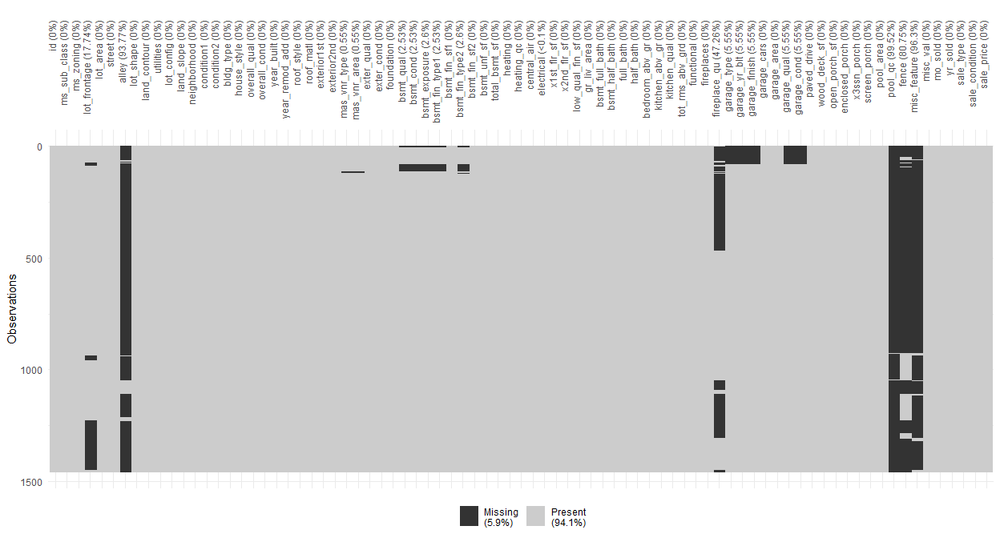

R v3 for Advanced Kaggle Housing Competition
================
Matthew Wilson
08 July, 2020

Necessary package and themes

``` r
library(tidyverse)
library(tidymodels)
library(skimr)
library(ggsci)
library(janitor)
library(corrr)
library(vip)
library(visdat)

pal <- pal_jco(palette = c("default"), alpha = 1)(10)

theme_set(theme_minimal())
theme_update(axis.line.x = element_line(color="dark grey"),
             axis.line.y = element_line(color="dark grey"))
```

### Kaggle Competition for Housing Prices (Regression)

``` r
housing_train <- clean_names(read_csv("../../data/ames_train.csv"))
housing_test <- clean_names(read_csv("../../data/ames_test.csv"))
glimpse(housing_train)
```

    ## Rows: 1,460
    ## Columns: 81
    ## $ id              <dbl> 1, 2, 3, 4, 5, 6, 7, 8, 9, 10, 11, 12, 13, 14, 15, ...
    ## $ ms_sub_class    <dbl> 60, 20, 60, 70, 60, 50, 20, 60, 50, 190, 20, 60, 20...
    ## $ ms_zoning       <chr> "RL", "RL", "RL", "RL", "RL", "RL", "RL", "RL", "RM...
    ## $ lot_frontage    <dbl> 65, 80, 68, 60, 84, 85, 75, NA, 51, 50, 70, 85, NA,...
    ## $ lot_area        <dbl> 8450, 9600, 11250, 9550, 14260, 14115, 10084, 10382...
    ## $ street          <chr> "Pave", "Pave", "Pave", "Pave", "Pave", "Pave", "Pa...
    ## $ alley           <chr> NA, NA, NA, NA, NA, NA, NA, NA, NA, NA, NA, NA, NA,...
    ## $ lot_shape       <chr> "Reg", "Reg", "IR1", "IR1", "IR1", "IR1", "Reg", "I...
    ## $ land_contour    <chr> "Lvl", "Lvl", "Lvl", "Lvl", "Lvl", "Lvl", "Lvl", "L...
    ## $ utilities       <chr> "AllPub", "AllPub", "AllPub", "AllPub", "AllPub", "...
    ## $ lot_config      <chr> "Inside", "FR2", "Inside", "Corner", "FR2", "Inside...
    ## $ land_slope      <chr> "Gtl", "Gtl", "Gtl", "Gtl", "Gtl", "Gtl", "Gtl", "G...
    ## $ neighborhood    <chr> "CollgCr", "Veenker", "CollgCr", "Crawfor", "NoRidg...
    ## $ condition1      <chr> "Norm", "Feedr", "Norm", "Norm", "Norm", "Norm", "N...
    ## $ condition2      <chr> "Norm", "Norm", "Norm", "Norm", "Norm", "Norm", "No...
    ## $ bldg_type       <chr> "1Fam", "1Fam", "1Fam", "1Fam", "1Fam", "1Fam", "1F...
    ## $ house_style     <chr> "2Story", "1Story", "2Story", "2Story", "2Story", "...
    ## $ overall_qual    <dbl> 7, 6, 7, 7, 8, 5, 8, 7, 7, 5, 5, 9, 5, 7, 6, 7, 6, ...
    ## $ overall_cond    <dbl> 5, 8, 5, 5, 5, 5, 5, 6, 5, 6, 5, 5, 6, 5, 5, 8, 7, ...
    ## $ year_built      <dbl> 2003, 1976, 2001, 1915, 2000, 1993, 2004, 1973, 193...
    ## $ year_remod_add  <dbl> 2003, 1976, 2002, 1970, 2000, 1995, 2005, 1973, 195...
    ## $ roof_style      <chr> "Gable", "Gable", "Gable", "Gable", "Gable", "Gable...
    ## $ roof_matl       <chr> "CompShg", "CompShg", "CompShg", "CompShg", "CompSh...
    ## $ exterior1st     <chr> "VinylSd", "MetalSd", "VinylSd", "Wd Sdng", "VinylS...
    ## $ exterior2nd     <chr> "VinylSd", "MetalSd", "VinylSd", "Wd Shng", "VinylS...
    ## $ mas_vnr_type    <chr> "BrkFace", "None", "BrkFace", "None", "BrkFace", "N...
    ## $ mas_vnr_area    <dbl> 196, 0, 162, 0, 350, 0, 186, 240, 0, 0, 0, 286, 0, ...
    ## $ exter_qual      <chr> "Gd", "TA", "Gd", "TA", "Gd", "TA", "Gd", "TA", "TA...
    ## $ exter_cond      <chr> "TA", "TA", "TA", "TA", "TA", "TA", "TA", "TA", "TA...
    ## $ foundation      <chr> "PConc", "CBlock", "PConc", "BrkTil", "PConc", "Woo...
    ## $ bsmt_qual       <chr> "Gd", "Gd", "Gd", "TA", "Gd", "Gd", "Ex", "Gd", "TA...
    ## $ bsmt_cond       <chr> "TA", "TA", "TA", "Gd", "TA", "TA", "TA", "TA", "TA...
    ## $ bsmt_exposure   <chr> "No", "Gd", "Mn", "No", "Av", "No", "Av", "Mn", "No...
    ## $ bsmt_fin_type1  <chr> "GLQ", "ALQ", "GLQ", "ALQ", "GLQ", "GLQ", "GLQ", "A...
    ## $ bsmt_fin_sf1    <dbl> 706, 978, 486, 216, 655, 732, 1369, 859, 0, 851, 90...
    ## $ bsmt_fin_type2  <chr> "Unf", "Unf", "Unf", "Unf", "Unf", "Unf", "Unf", "B...
    ## $ bsmt_fin_sf2    <dbl> 0, 0, 0, 0, 0, 0, 0, 32, 0, 0, 0, 0, 0, 0, 0, 0, 0,...
    ## $ bsmt_unf_sf     <dbl> 150, 284, 434, 540, 490, 64, 317, 216, 952, 140, 13...
    ## $ total_bsmt_sf   <dbl> 856, 1262, 920, 756, 1145, 796, 1686, 1107, 952, 99...
    ## $ heating         <chr> "GasA", "GasA", "GasA", "GasA", "GasA", "GasA", "Ga...
    ## $ heating_qc      <chr> "Ex", "Ex", "Ex", "Gd", "Ex", "Ex", "Ex", "Ex", "Gd...
    ## $ central_air     <chr> "Y", "Y", "Y", "Y", "Y", "Y", "Y", "Y", "Y", "Y", "...
    ## $ electrical      <chr> "SBrkr", "SBrkr", "SBrkr", "SBrkr", "SBrkr", "SBrkr...
    ## $ x1st_flr_sf     <dbl> 856, 1262, 920, 961, 1145, 796, 1694, 1107, 1022, 1...
    ## $ x2nd_flr_sf     <dbl> 854, 0, 866, 756, 1053, 566, 0, 983, 752, 0, 0, 114...
    ## $ low_qual_fin_sf <dbl> 0, 0, 0, 0, 0, 0, 0, 0, 0, 0, 0, 0, 0, 0, 0, 0, 0, ...
    ## $ gr_liv_area     <dbl> 1710, 1262, 1786, 1717, 2198, 1362, 1694, 2090, 177...
    ## $ bsmt_full_bath  <dbl> 1, 0, 1, 1, 1, 1, 1, 1, 0, 1, 1, 1, 1, 0, 1, 0, 1, ...
    ## $ bsmt_half_bath  <dbl> 0, 1, 0, 0, 0, 0, 0, 0, 0, 0, 0, 0, 0, 0, 0, 0, 0, ...
    ## $ full_bath       <dbl> 2, 2, 2, 1, 2, 1, 2, 2, 2, 1, 1, 3, 1, 2, 1, 1, 1, ...
    ## $ half_bath       <dbl> 1, 0, 1, 0, 1, 1, 0, 1, 0, 0, 0, 0, 0, 0, 1, 0, 0, ...
    ## $ bedroom_abv_gr  <dbl> 3, 3, 3, 3, 4, 1, 3, 3, 2, 2, 3, 4, 2, 3, 2, 2, 2, ...
    ## $ kitchen_abv_gr  <dbl> 1, 1, 1, 1, 1, 1, 1, 1, 2, 2, 1, 1, 1, 1, 1, 1, 1, ...
    ## $ kitchen_qual    <chr> "Gd", "TA", "Gd", "Gd", "Gd", "TA", "Gd", "TA", "TA...
    ## $ tot_rms_abv_grd <dbl> 8, 6, 6, 7, 9, 5, 7, 7, 8, 5, 5, 11, 4, 7, 5, 5, 5,...
    ## $ functional      <chr> "Typ", "Typ", "Typ", "Typ", "Typ", "Typ", "Typ", "T...
    ## $ fireplaces      <dbl> 0, 1, 1, 1, 1, 0, 1, 2, 2, 2, 0, 2, 0, 1, 1, 0, 1, ...
    ## $ fireplace_qu    <chr> NA, "TA", "TA", "Gd", "TA", NA, "Gd", "TA", "TA", "...
    ## $ garage_type     <chr> "Attchd", "Attchd", "Attchd", "Detchd", "Attchd", "...
    ## $ garage_yr_blt   <dbl> 2003, 1976, 2001, 1998, 2000, 1993, 2004, 1973, 193...
    ## $ garage_finish   <chr> "RFn", "RFn", "RFn", "Unf", "RFn", "Unf", "RFn", "R...
    ## $ garage_cars     <dbl> 2, 2, 2, 3, 3, 2, 2, 2, 2, 1, 1, 3, 1, 3, 1, 2, 2, ...
    ## $ garage_area     <dbl> 548, 460, 608, 642, 836, 480, 636, 484, 468, 205, 3...
    ## $ garage_qual     <chr> "TA", "TA", "TA", "TA", "TA", "TA", "TA", "TA", "Fa...
    ## $ garage_cond     <chr> "TA", "TA", "TA", "TA", "TA", "TA", "TA", "TA", "TA...
    ## $ paved_drive     <chr> "Y", "Y", "Y", "Y", "Y", "Y", "Y", "Y", "Y", "Y", "...
    ## $ wood_deck_sf    <dbl> 0, 298, 0, 0, 192, 40, 255, 235, 90, 0, 0, 147, 140...
    ## $ open_porch_sf   <dbl> 61, 0, 42, 35, 84, 30, 57, 204, 0, 4, 0, 21, 0, 33,...
    ## $ enclosed_porch  <dbl> 0, 0, 0, 272, 0, 0, 0, 228, 205, 0, 0, 0, 0, 0, 176...
    ## $ x3ssn_porch     <dbl> 0, 0, 0, 0, 0, 320, 0, 0, 0, 0, 0, 0, 0, 0, 0, 0, 0...
    ## $ screen_porch    <dbl> 0, 0, 0, 0, 0, 0, 0, 0, 0, 0, 0, 0, 176, 0, 0, 0, 0...
    ## $ pool_area       <dbl> 0, 0, 0, 0, 0, 0, 0, 0, 0, 0, 0, 0, 0, 0, 0, 0, 0, ...
    ## $ pool_qc         <chr> NA, NA, NA, NA, NA, NA, NA, NA, NA, NA, NA, NA, NA,...
    ## $ fence           <chr> NA, NA, NA, NA, NA, "MnPrv", NA, NA, NA, NA, NA, NA...
    ## $ misc_feature    <chr> NA, NA, NA, NA, NA, "Shed", NA, "Shed", NA, NA, NA,...
    ## $ misc_val        <dbl> 0, 0, 0, 0, 0, 700, 0, 350, 0, 0, 0, 0, 0, 0, 0, 0,...
    ## $ mo_sold         <dbl> 2, 5, 9, 2, 12, 10, 8, 11, 4, 1, 2, 7, 9, 8, 5, 7, ...
    ## $ yr_sold         <dbl> 2008, 2007, 2008, 2006, 2008, 2009, 2007, 2009, 200...
    ## $ sale_type       <chr> "WD", "WD", "WD", "WD", "WD", "WD", "WD", "WD", "WD...
    ## $ sale_condition  <chr> "Normal", "Normal", "Normal", "Abnorml", "Normal", ...
    ## $ sale_price      <dbl> 208500, 181500, 223500, 140000, 250000, 143000, 307...

``` r
#great way to see na percent of each column
vapply(housing_train, function(x) mean(is.na(x)), c(num = 0))
```

    ##              id    ms_sub_class       ms_zoning    lot_frontage        lot_area 
    ##    0.0000000000    0.0000000000    0.0000000000    0.1773972603    0.0000000000 
    ##          street           alley       lot_shape    land_contour       utilities 
    ##    0.0000000000    0.9376712329    0.0000000000    0.0000000000    0.0000000000 
    ##      lot_config      land_slope    neighborhood      condition1      condition2 
    ##    0.0000000000    0.0000000000    0.0000000000    0.0000000000    0.0000000000 
    ##       bldg_type     house_style    overall_qual    overall_cond      year_built 
    ##    0.0000000000    0.0000000000    0.0000000000    0.0000000000    0.0000000000 
    ##  year_remod_add      roof_style       roof_matl     exterior1st     exterior2nd 
    ##    0.0000000000    0.0000000000    0.0000000000    0.0000000000    0.0000000000 
    ##    mas_vnr_type    mas_vnr_area      exter_qual      exter_cond      foundation 
    ##    0.0054794521    0.0054794521    0.0000000000    0.0000000000    0.0000000000 
    ##       bsmt_qual       bsmt_cond   bsmt_exposure  bsmt_fin_type1    bsmt_fin_sf1 
    ##    0.0253424658    0.0253424658    0.0260273973    0.0253424658    0.0000000000 
    ##  bsmt_fin_type2    bsmt_fin_sf2     bsmt_unf_sf   total_bsmt_sf         heating 
    ##    0.0260273973    0.0000000000    0.0000000000    0.0000000000    0.0000000000 
    ##      heating_qc     central_air      electrical     x1st_flr_sf     x2nd_flr_sf 
    ##    0.0000000000    0.0000000000    0.0006849315    0.0000000000    0.0000000000 
    ## low_qual_fin_sf     gr_liv_area  bsmt_full_bath  bsmt_half_bath       full_bath 
    ##    0.0000000000    0.0000000000    0.0000000000    0.0000000000    0.0000000000 
    ##       half_bath  bedroom_abv_gr  kitchen_abv_gr    kitchen_qual tot_rms_abv_grd 
    ##    0.0000000000    0.0000000000    0.0000000000    0.0000000000    0.0000000000 
    ##      functional      fireplaces    fireplace_qu     garage_type   garage_yr_blt 
    ##    0.0000000000    0.0000000000    0.4726027397    0.0554794521    0.0554794521 
    ##   garage_finish     garage_cars     garage_area     garage_qual     garage_cond 
    ##    0.0554794521    0.0000000000    0.0000000000    0.0554794521    0.0554794521 
    ##     paved_drive    wood_deck_sf   open_porch_sf  enclosed_porch     x3ssn_porch 
    ##    0.0000000000    0.0000000000    0.0000000000    0.0000000000    0.0000000000 
    ##    screen_porch       pool_area         pool_qc           fence    misc_feature 
    ##    0.0000000000    0.0000000000    0.9952054795    0.8075342466    0.9630136986 
    ##        misc_val         mo_sold         yr_sold       sale_type  sale_condition 
    ##    0.0000000000    0.0000000000    0.0000000000    0.0000000000    0.0000000000 
    ##      sale_price 
    ##    0.0000000000

``` r
vis_miss(housing_train, cluster = TRUE)+
  theme(axis.text.x = element_text(angle = 90, vjust = 0.5, hjust=1))
```



``` r
col_nas <- tibble(feature = names(housing_train), 
                  pct_na = vapply(housing_train, function(x) mean(is.na(x)), c(num = 0))) %>% 
  arrange(desc(pct_na)) %>% 
  filter(pct_na < .15)

col_nas_rm <- col_nas$feature

col_nas
```

    ## # A tibble: 75 x 2
    ##    feature        pct_na
    ##    <chr>           <dbl>
    ##  1 garage_type    0.0555
    ##  2 garage_yr_blt  0.0555
    ##  3 garage_finish  0.0555
    ##  4 garage_qual    0.0555
    ##  5 garage_cond    0.0555
    ##  6 bsmt_exposure  0.0260
    ##  7 bsmt_fin_type2 0.0260
    ##  8 bsmt_qual      0.0253
    ##  9 bsmt_cond      0.0253
    ## 10 bsmt_fin_type1 0.0253
    ## # ... with 65 more rows

``` r
housing_cor <- housing_train %>% 
                  select(where(is.numeric), -id) %>% 
                  correlate() %>% 
                  rearrange() %>% 
                  shave()

#fashion(housing_cor)

rplot(housing_cor, print_cor = TRUE, shape = 20)+
  theme(axis.text.x = element_text(angle = 90, vjust = 0.5, hjust=1))
```


``` r
housing_train %>%  
        select(where(is.numeric), -id) %>% 
        correlate() %>%  
        focus(sale_price) %>% 
        mutate(rowname = reorder(rowname, sale_price)) %>%
        ggplot(aes(rowname, sale_price)) +
        geom_col() + coord_flip()
```


#### identify columns for label encoding or one hot

Using dplyr look into columns with high cardinality and give a labeling
by sorting on sale price, will not include in dummy variables

``` r
col_cats <- housing_train %>% summarise(across(where(is.character), n_distinct)) %>% 
  pivot_longer(everything(), names_to = 'feature', values_to = 'count') %>% 
  arrange(desc(count)) %>% 
  filter(count >= 10)

label_enc <- col_cats$feature

head(col_cats)
```

    ## # A tibble: 3 x 2
    ##   feature      count
    ##   <chr>        <int>
    ## 1 neighborhood    25
    ## 2 exterior2nd     16
    ## 3 exterior1st     15

``` r
housing_train %>% 
  ggplot(aes(fct_infreq(neighborhood)))+
  geom_bar() + coord_flip()
```


### Outlier issues

``` r
housing_train %>%
  ggplot(aes(x = gr_liv_area, y = sale_price)) +
  geom_point(alpha = 0.75, color=pal[1]) +
  scale_y_continuous(breaks= seq(0, 800000, by=200000), labels = scales::comma) +
  labs(x = "Above ground living area", y = "Sale Price", title = "Sale Price by Above Ground Living Area")
```


``` r
#remove huge outliers

housing_train <-
  housing_train %>% 
  filter(!(gr_liv_area > 4000 & sale_price < 200000))
```

### initial data split

``` r
#resample

set.seed(19)
data_split <- initial_split(housing_train, 
                            prop = .80,
                            strata = sale_price)

X_train <- training(data_split)
X_test <- testing(data_split)
```

### preprocessing

  - Filter out zero or near-zero variance features.
  - Perform imputation if required.
  - Normalize to resolve numeric feature skewness.
  - Standardize (center and scale) numeric features.
  - Perform dimension reduction (e.g., PCA) on numeric features.
  - One-hot or dummy encode categorical features

<!-- end list -->

``` r
#recipes

xgb_recipe <- 
  recipe(sale_price ~ ., data = X_train) %>% 
  update_role(id, new_role = "id") %>%
  step_nzv(all_nominal()) %>% 
  step_log(all_outcomes(), skip = TRUE) %>% 
  step_string2factor(all_nominal(), -all_outcomes()) %>%  
  step_unknown(matches("bsmt|garage|mas"),-all_numeric(), new_level = "other") %>% 
  step_mutate_at(matches("bsmt|garage|mas"), -all_nominal(), fn = ~ tidyr::replace_na(., 0)) %>% 
  step_knnimpute(all_predictors(), neighbors = 6) %>%
  step_other(screen_porch, threshold = .1, other = ">0") %>% 
  step_integer(matches("qual|qc|qu|cond"), -overall_qual,-overall_cond) %>% 
  step_other(neighborhood, threshold = 0.01) %>% 
  step_mutate(
    total_sf = total_bsmt_sf + x1st_flr_sf + x2nd_flr_sf,
    avg_rm_sf = gr_liv_area / tot_rms_abv_grd,
    total_baths = bsmt_full_bath + (bsmt_half_bath * 0.5) + full_bath + (half_bath * 0.5),
    age = yr_sold - year_built,
    new = forcats::as_factor(if_else(yr_sold == year_built, 1, 0)),
    old = forcats::as_factor(if_else(year_built < 1940, 1, 0)),
    pool = forcats::as_factor(if_else(pool_area > 0, 1, 0)),
    basement = forcats::as_factor(if_else(total_bsmt_sf > 0, 1, 0)),
    garage = forcats::as_factor(if_else(garage_area > 0, 1, 0)),
    remodeled = forcats::as_factor(if_else(year_remod_add > year_built, 1, 0))
    ) %>%
  step_normalize(all_numeric(), -all_outcomes(), -has_role("id")) %>% 
  step_dummy(all_nominal(), -all_outcomes(), one_hot = TRUE)


#step_pca(all_numeric(), -all_outcomes(), threshold = .95) %>% 
#step_BoxCox(-all_outcomes()) %>%
#step_corr(all_numeric(), -all_outcomes(),threshold = .90)
```

### quick validation on best preprocessing before moving further

``` r
recipe(sale_price ~ ., data = X_train) %>%
  step_mutate_at(matches("bsmt|garage|mas"), -all_nominal(), fn = ~ replace_na(., 0)) %>% 
  prep(X_train) %>%
  bake(X_train) %>%
  summarize(test = mean(is.na(mas_vnr_area)))
```

    ## # A tibble: 1 x 1
    ##    test
    ##   <dbl>
    ## 1     0

``` r
xgb_spec <- boost_tree(
      trees = 1000,
      min_n = 25,
      tree_depth = 10,
      learn_rate = 0.007,
      loss_reduction = 3.06673510485747e-08
      ) %>% 
  set_engine("xgboost", objective = 'reg:squarederror') %>% 
  set_mode('regression')


set.seed(19)
folds <- vfold_cv(X_train, strata = sale_price, v = 3)

xgb_results <- xgb_spec %>% 
  fit_resamples(
    preprocessor = xgb_recipe,
    resamples = folds,
    metrics = metric_set(rmse, rsq, mae),
    control = control_resamples(save_pred = TRUE)
    )
  
xgb_results %>% unnest(.predictions) %>% 
  mutate(.pred = exp(.pred), sale_price = sale_price) %>% 
  metrics(sale_price, .pred)
```

    ## # A tibble: 3 x 3
    ##   .metric .estimator .estimate
    ##   <chr>   <chr>          <dbl>
    ## 1 rmse    standard   27638.   
    ## 2 rsq     standard       0.886
    ## 3 mae     standard   15593.

### model spec for XGBoost tuning

``` r
#parsnip and tune

xgb_model <-
    boost_tree(
      mode = 'regression',
      trees = 1000,
      min_n = tune(),
      tree_depth = tune(),
      sample_size = tune(), 
      mtry = tune(),
      learn_rate = tune(),
      loss_reduction = tune()
    ) %>% 
    set_engine('xgboost', objective = 'reg:squarederror')
```

### grid spec parameters

``` r
#dials

xgb_params <-
  parameters(
    min_n(),
    tree_depth(),
    learn_rate(),
    loss_reduction(),
    sample_size = sample_prop(),
    mtry()
    ) %>% 
    mutate(object = map(object, finalize, X_train))

xgb_grid <- grid_latin_hypercube(
    xgb_params,
    size = 30
)

xgb_grid
```

    ## # A tibble: 30 x 6
    ##    min_n tree_depth learn_rate loss_reduction sample_size  mtry
    ##    <int>      <int>      <dbl>          <dbl>       <dbl> <int>
    ##  1     5         14   3.12e- 2  0.00000984          0.284    42
    ##  2    30          8   1.54e-10  0.375               0.186    25
    ##  3     8          9   3.73e- 9  0.000702            0.121     7
    ##  4    33         12   3.69e- 8  0.00000000135       0.545    44
    ##  5    28          3   1.17e- 6 19.0                 0.476    18
    ##  6    22          4   6.91e- 9  0.0000000144        0.330     5
    ##  7    31          7   3.59e- 6  0.000000113         0.579    69
    ##  8    40          4   2.69e- 4  0.00000000264       0.852    25
    ##  9    12          4   2.24e- 6  0.0183              0.814    52
    ## 10     4         11   1.67e- 3  0.00000335          0.945    47
    ## # ... with 20 more rows

### setup Workflow

``` r
xgb_wf <- 
  workflow() %>%
  add_model(xgb_model) %>% 
  add_recipe(xgb_recipe)
```

### hyperparameter tuning

``` r
# tune resample set
set.seed(19)
folds <- vfold_cv(X_train, strata = sale_price, v = 5)

xgb_tuned <- tune_grid(
  xgb_wf,
  resamples = folds,
  grid = xgb_grid,
  metrics = metric_set(rmse, rsq, mae),
  control = control_grid(save_pred = TRUE)
)
```

``` r
#top 5 best hyperparamaters
xgb_tuned %>%  show_best(metric = "rsq")
```

    ## # A tibble: 5 x 11
    ##    mtry min_n tree_depth learn_rate loss_reduction sample_size .metric
    ##   <int> <int>      <int>      <dbl>          <dbl>       <dbl> <chr>  
    ## 1    42     5         14    0.0312    0.00000984         0.284 rsq    
    ## 2    67    10          3    0.00737   0.000187           0.821 rsq    
    ## 3    61    35         13    0.0183    0.0000000205       0.236 rsq    
    ## 4    11    38         13    0.00365   0.0337             0.369 rsq    
    ## 5    38    17          2    0.0571    9.40               0.616 rsq    
    ## # ... with 4 more variables: .estimator <chr>, mean <dbl>, n <int>,
    ## #   std_err <dbl>

``` r
#best hyperparamaters
xgb_best_params <- xgb_tuned %>% select_best(metric = "rsq")

xgb_best_params
```

    ## # A tibble: 1 x 6
    ##    mtry min_n tree_depth learn_rate loss_reduction sample_size
    ##   <int> <int>      <int>      <dbl>          <dbl>       <dbl>
    ## 1    42     5         14     0.0312     0.00000984       0.284

``` r
#create model with best tuning parameters

xgb_model_final <- xgb_model %>% 
  finalize_model(xgb_best_params)

#update the wofklow
xgb_wf <- update_model(xgb_wf, xgb_model_final)
```

### evaluate Performance

``` r
#training evaluation

#create cv folds
train_folds <- vfold_cv(X_train, v = 5, strata = sale_price)

#resample
xgb_cv <- fit_resamples(
  xgb_wf,
  resamples = train_folds,
  metrics = metric_set(rmse, rsq, mae),
  control = control_resamples(save_pred = TRUE)
  )

xgb_cv %>% unnest(.predictions) %>% metrics(sale_price, .pred)
```

    ## # A tibble: 3 x 3
    ##   .metric .estimator  .estimate
    ##   <chr>   <chr>           <dbl>
    ## 1 rmse    standard   198368.   
    ## 2 rsq     standard        0.827
    ## 3 mae     standard   181472.

``` r
feat_imp <-
  xgb_wf %>%
    fit(data = X_train) %>%
    pull_workflow_fit() 

feat_imp %>% 
  vip(geom = 'col', aesthetics = list(fill = pal[1]))
```

    ## Warning: `as.tibble()` is deprecated as of tibble 2.0.0.
    ## Please use `as_tibble()` instead.
    ## The signature and semantics have changed, see `?as_tibble`.
    ## This warning is displayed once every 8 hours.
    ## Call `lifecycle::last_warnings()` to see where this warning was generated.


``` r
#vi(feat_imp)
```

``` r
xgb_fit_workflow <- 
  xgb_wf %>% 
  fit(data = X_train)

# test set
test_prediction <-
    xgb_fit_workflow %>% 
    predict(X_test) %>% 
    bind_cols(X_test) %>% 
    mutate(.pred = exp(.pred))

test_prediction %>%  metrics(sale_price, .pred)
```

    ## # A tibble: 3 x 3
    ##   .metric .estimator .estimate
    ##   <chr>   <chr>          <dbl>
    ## 1 rmse    standard   20896.   
    ## 2 rsq     standard       0.929
    ## 3 mae     standard   13376.

### plot residuals

``` r
test_prediction %>%
  arrange(.pred) %>%
  mutate(residual_pct = (sale_price - .pred) / .pred) %>%
  select(.pred, residual_pct) %>% 
ggplot(aes(x = .pred, y = residual_pct)) +
  geom_point(color = pal[1]) +
  xlab("Predicted Sale Price") +
  ylab("Residual (%)") +
  scale_x_continuous(labels = scales::dollar_format()) +
  scale_y_continuous(labels = scales::percent)
```


### create final output for kaggle submission

``` r
xgb_fit_workflow <- 
  xgb_wf %>% 
  fit(data = housing_train)

final_prediction <-
  xgb_fit_workflow %>% 
    predict(housing_test) %>% 
    bind_cols(housing_test) %>% 
    mutate(.pred = exp(.pred))

output <- final_prediction %>% 
  rename(Id = id, SalePrice = .pred) %>% 
  select(Id, SalePrice)

write.csv(output,file = "output7_8.csv", row.names=FALSE)
```
