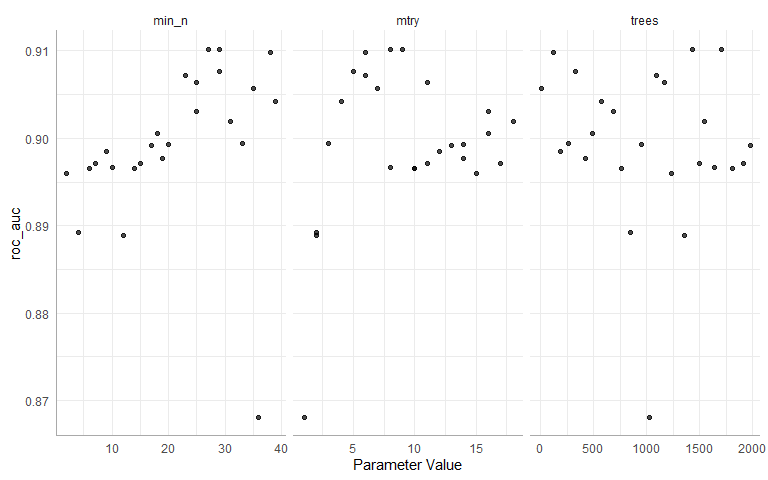

R for Titanic
================
Matthew Wilson
2020-06-22

Necessary package and themes

``` r
library(tidyverse)
library(tidymodels)
library(skimr)
library(ggsci)

pal <- pal_jco(palette = c("default"), alpha = 1)(10)

theme_set(theme_minimal())
theme_update(axis.line.x = element_line(color="dark grey"),
             axis.line.y = element_line(color="dark grey"))
```

##### loading the data

``` r
train <- read_csv("./train.csv")
test <- read_csv("./test.csv")
```

Preview the training data

``` r
glimpse(train)
```

    ## Rows: 891
    ## Columns: 12
    ## $ PassengerId <dbl> 1, 2, 3, 4, 5, 6, 7, 8, 9, 10, 11, 12, 13, 14, 15, 16, ...
    ## $ Survived    <dbl> 0, 1, 1, 1, 0, 0, 0, 0, 1, 1, 1, 1, 0, 0, 0, 1, 0, 1, 0...
    ## $ Pclass      <dbl> 3, 1, 3, 1, 3, 3, 1, 3, 3, 2, 3, 1, 3, 3, 3, 2, 3, 2, 3...
    ## $ Name        <chr> "Braund, Mr. Owen Harris", "Cumings, Mrs. John Bradley ...
    ## $ Sex         <chr> "male", "female", "female", "female", "male", "male", "...
    ## $ Age         <dbl> 22, 38, 26, 35, 35, NA, 54, 2, 27, 14, 4, 58, 20, 39, 1...
    ## $ SibSp       <dbl> 1, 1, 0, 1, 0, 0, 0, 3, 0, 1, 1, 0, 0, 1, 0, 0, 4, 0, 1...
    ## $ Parch       <dbl> 0, 0, 0, 0, 0, 0, 0, 1, 2, 0, 1, 0, 0, 5, 0, 0, 1, 0, 0...
    ## $ Ticket      <chr> "A/5 21171", "PC 17599", "STON/O2. 3101282", "113803", ...
    ## $ Fare        <dbl> 7.2500, 71.2833, 7.9250, 53.1000, 8.0500, 8.4583, 51.86...
    ## $ Cabin       <chr> NA, "C85", NA, "C123", NA, NA, "E46", NA, NA, NA, "G6",...
    ## $ Embarked    <chr> "S", "C", "S", "S", "S", "Q", "S", "S", "S", "C", "S", ...

#### Select just the relevant features

``` r
X <- bind_rows(train, test)

X %>% 
  mutate(Pclass = factor(Pclass),
         Embarked = factor(Embarked),
         Survived = factor(Survived),
         Sex = factor(Sex))-> X

features <- c('Pclass', 'Name', 'Sex', 'Age', 'SibSp', 'Parch', 'Fare', 'Embarked')

X <- X %>% select(Survived, all_of(features))

glimpse(X)
```

    ## Rows: 1,309
    ## Columns: 9
    ## $ Survived <fct> 0, 1, 1, 1, 0, 0, 0, 0, 1, 1, 1, 1, 0, 0, 0, 1, 0, 1, 0, 1...
    ## $ Pclass   <fct> 3, 1, 3, 1, 3, 3, 1, 3, 3, 2, 3, 1, 3, 3, 3, 2, 3, 2, 3, 3...
    ## $ Name     <chr> "Braund, Mr. Owen Harris", "Cumings, Mrs. John Bradley (Fl...
    ## $ Sex      <fct> male, female, female, female, male, male, male, male, fema...
    ## $ Age      <dbl> 22, 38, 26, 35, 35, NA, 54, 2, 27, 14, 4, 58, 20, 39, 14, ...
    ## $ SibSp    <dbl> 1, 1, 0, 1, 0, 0, 0, 3, 0, 1, 1, 0, 0, 1, 0, 0, 4, 0, 1, 0...
    ## $ Parch    <dbl> 0, 0, 0, 0, 0, 0, 0, 1, 2, 0, 1, 0, 0, 5, 0, 0, 1, 0, 0, 0...
    ## $ Fare     <dbl> 7.2500, 71.2833, 7.9250, 53.1000, 8.0500, 8.4583, 51.8625,...
    ## $ Embarked <fct> S, C, S, S, S, Q, S, S, S, C, S, S, S, S, S, S, Q, S, S, C...

#### clean up `Name` feature to be smaller factor

``` r
X <- mutate(X, Title = str_sub(Name, str_locate(Name, ",")[,1] + 2, str_locate(Name, "\\.")[,1]-1))
X$Title <- as_factor(X$Title)

print(X %>% group_by(Title) %>% tally(sort = TRUE))
```

    ## # A tibble: 18 x 2
    ##    Title            n
    ##    <fct>        <int>
    ##  1 Mr             757
    ##  2 Miss           260
    ##  3 Mrs            197
    ##  4 Master          61
    ##  5 Rev              8
    ##  6 Dr               8
    ##  7 Col              4
    ##  8 Ms               2
    ##  9 Major            2
    ## 10 Mlle             2
    ## 11 Don              1
    ## 12 Mme              1
    ## 13 Lady             1
    ## 14 Sir              1
    ## 15 Capt             1
    ## 16 the Countess     1
    ## 17 Jonkheer         1
    ## 18 Dona             1

``` r
X <- X %>%
          mutate(Title = fct_collapse(Title, "Miss" = c("Mlle", "Ms"), "Mrs" = "Mme", 
                                      "Ranked" = c( "Major", "Dr", "Capt", "Col", "Rev"),
                                      "Royalty" = c("Lady", "Dona", "the Countess", "Don", "Sir", "Jonkheer"))) 


ggplot(X[1:891,], aes(x = Sex, fill = Survived)) +
          geom_bar(position = "fill") +
          ylab("Survival Rate") +
          geom_hline(yintercept = sum(X[1:891,] %>% filter(Survived == 1) %>% 
                                        group_by(Survived) %>% tally %>% 
                                        select(n)) / nrow(X), col = "white", lty = 2) +
          ggtitle("Survival Rate by Title")+
          scale_fill_manual(values = pal)
```


#### create more factor variables alone status

``` r
X <- X %>% mutate(Alone = factor(ifelse(SibSp + Parch < 1, "Yes", "No")))

ggplot(X[1:891,], aes(x = Alone, fill = Survived))+
          geom_bar(position = "fill")+
          ylab("Survival Rate")+
          geom_hline(yintercept = sum(X[1:891,] %>% filter(Survived == 1) %>% 
                                        group_by(Survived) %>% tally %>% 
                                        select(n)) / nrow(X),col = "white", lty = 2)+
          facet_wrap(~Sex)+
          ggtitle("Survival Rate by Solo Travel and Sex")+
          scale_fill_manual(values = pal)
```


#### create more factor variables parent status

``` r
X <- X %>% mutate(Parent = factor(ifelse(Parch > 0, "Yes", "No")))

ggplot(X[1:891,], aes(x = Parent, fill = Survived))+
          geom_bar(position = "fill")+
          ylab("Survival Rate")+
          geom_hline(yintercept = sum(X[1:891,] %>% filter(Survived == 1) %>% 
                                        group_by(Survived) %>% tally %>% 
                                        select(n)) / nrow(X),col = "white", lty = 2)+
          facet_wrap(~Sex)+
          ggtitle("Survival Rate by Parenting and Sex")+
          scale_fill_manual(values = pal)
```


#### create more factor variables family size

``` r
X <- X %>% mutate(FamilyType = factor(ifelse(Parch + SibSp + 1 > 4, "Large", 
                                             ifelse(Parch + SibSp + 1 == 1, "Single", "Medium"))))

ggplot(X[1:891,], aes(x = FamilyType, fill = Survived))+
          geom_bar(position = "fill")+
          ylab("Survival Rate")+
          geom_hline(yintercept = sum(X[1:891,] %>% filter(Survived == 1) %>% 
                                        group_by(Survived) %>% tally %>% 
                                        select(n)) / nrow(X),col = "white", lty = 2)+
          facet_wrap(~Sex)+
          ggtitle("Survival Rate by Family Type")+
          scale_fill_manual(values = pal)
```


#### Finalize the data for modeling , split apart train and test again

``` r
X <- X %>% select(-Name)
X <- X %>% relocate(where(is.numeric)) #this is useful
X <- X %>% relocate(Survived, .before = Age) #this is even more useful!

X_test <- X %>% filter(is.na(Survived))
X <- X %>% filter(!is.na(Survived))
```

## Modeling

#### Split training to test

``` r
data_split <- initial_split(X, prop = .80)

train_data <- training(data_split)
test_data <- testing(data_split)

train_data$Survived <- factor(train_data$Survived, labels = c("No", "Yes"))
test_data$Survived <- factor(test_data$Survived, labels = c("No", "Yes"))
X$Survived <- factor(X$Survived, labels = c("No", "Yes"))
```

#### preprocessing

``` r
titanic_rec <- 
  recipe(Survived ~ ., data = train_data) %>%
  step_knnimpute(Embarked, Fare, Age, neighbors = 3) %>% 
  step_dummy(all_nominal(), -all_outcomes()) %>% 
  step_zv(all_predictors())

titanic_prep <- prep(titanic_rec, training = train_data)

#if you want to see the data preprocessed, nice that it returns a tibble!
#titanic_juiced <- juice(titanic_prep)
#titanic_bake <- bake(titanic_prep, new_data = train_data)

test_bake <- bake(titanic_prep, new_data = test_data)
```

#### modeling

``` r
rf_mod <-
  rand_forest(mode = "classification") %>% 
  set_engine("ranger")

rf_fit <- rf_mod %>% 
  fit(Survived ~ ., data = bake(titanic_prep, new_data = train_data))
```

``` r
rf_testing_pred <- 
  predict(rf_fit, test_bake) %>% 
  bind_cols(predict(rf_fit, test_bake, type = "prob")) %>% 
  bind_cols(test_bake %>% select(Survived))

print(rf_testing_pred %>% accuracy(truth = Survived, .pred_class))
```

    ## # A tibble: 1 x 3
    ##   .metric  .estimator .estimate
    ##   <chr>    <chr>          <dbl>
    ## 1 accuracy binary         0.882

``` r
print(rf_testing_pred %>% roc_auc(truth = Survived, .pred_Yes))
```

    ## # A tibble: 1 x 3
    ##   .metric .estimator .estimate
    ##   <chr>   <chr>          <dbl>
    ## 1 roc_auc binary         0.903

``` r
rf_testing_pred %>% 
  roc_curve(truth = Survived, .pred_Yes) %>% 
  autoplot()
```


``` r
cm <- rf_testing_pred %>% conf_mat(truth = Survived, .pred_class)
autoplot(cm, type = "heatmap")
```


``` r
print(summary(cm) %>% 
        filter(.metric %in% c("accuracy", "kap", "recall", "precision", "f_meas")) %>% 
        select(.metric, .estimate)) 
```

    ## # A tibble: 5 x 2
    ##   .metric   .estimate
    ##   <chr>         <dbl>
    ## 1 accuracy      0.882
    ## 2 kap           0.724
    ## 3 precision     0.876
    ## 4 recall        0.958
    ## 5 f_meas        0.915

### Make Final Test Holdout Predictions

``` r
test_bake2 <- bake(titanic_prep, new_data = X_test)

y_pred <- predict(rf_fit, test_bake2)
y_pred$.pred_class <- as.numeric(y_pred$.pred_class) - 1

#output <- bind_cols(test$PassengerId, y_pred) %>% rename("PassengerID" = "...1", "Survived" = ".pred_class")
#write.csv(output,file = "output6_22.csv", row.names=FALSE)
```

## A more tidy way with workflow with tuning

``` r
cores <- parallel::detectCores()

rf_mod2 <-
  rand_forest(mtry = tune(), min_n = tune(), trees = tune()) %>% 
  set_engine("ranger", num.threads = cores) %>% 
  set_mode("classification")


rf_recipe <- 
  recipe(Survived ~ ., data = train_data) %>%
  step_knnimpute(Embarked, Fare, Age, neighbors = 3) %>% 
  step_dummy(all_nominal(), -all_outcomes()) %>% 
  step_zv(all_predictors())

rf_workflow <-
  workflow() %>%
  add_model(rf_mod2) %>% 
  add_recipe(rf_recipe)

rf_mod2
```

    ## Random Forest Model Specification (classification)
    ## 
    ## Main Arguments:
    ##   mtry = tune()
    ##   trees = tune()
    ##   min_n = tune()
    ## 
    ## Engine-Specific Arguments:
    ##   num.threads = cores
    ## 
    ## Computational engine: ranger

``` r
rf_mod2 %>% 
  parameters()
```

    ## Collection of 3 parameters for tuning
    ## 
    ##     id parameter type object class
    ##   mtry           mtry    nparam[?]
    ##  trees          trees    nparam[+]
    ##  min_n          min_n    nparam[+]
    ## 
    ## Model parameters needing finalization:
    ##    # Randomly Selected Predictors ('mtry')
    ## 
    ## See `?dials::finalize` or `?dials::update.parameters` for more information.

### Tune the model

``` r
set.seed(50)
val_set <- validation_split(X, prop = 0.80)

rf_res <- 
  rf_workflow %>% 
  tune_grid(val_set,
            grid = 25,
            control = control_grid(save_pred = TRUE),
            metrics = metric_set(roc_auc))

rf_res %>% 
  show_best(metric = "roc_auc")
```

    ## # A tibble: 5 x 8
    ##    mtry trees min_n .metric .estimator  mean     n std_err
    ##   <int> <int> <int> <chr>   <chr>      <dbl> <int>   <dbl>
    ## 1     8  1435    29 roc_auc binary     0.910     1      NA
    ## 2     9  1701    27 roc_auc binary     0.910     1      NA
    ## 3     6   120    38 roc_auc binary     0.910     1      NA
    ## 4     5   322    29 roc_auc binary     0.908     1      NA
    ## 5     6  1090    23 roc_auc binary     0.907     1      NA

### Plot the tuning

``` r
autoplot(rf_res)
```



### selecting the best model

``` r
rf_best <- 
  rf_res %>% 
  select_best(metric = "roc_auc")
rf_best
```

    ## # A tibble: 1 x 3
    ##    mtry trees min_n
    ##   <int> <int> <int>
    ## 1     8  1435    29

``` r
rf_auc_1 <-
rf_testing_pred %>% 
  roc_curve(truth = Survived, .pred_Yes) %>% 
  mutate(model = "non_tuned")

# control_grid(save_pred = TRUE) so you can select the predictions
rf_auc_2 <-
rf_res %>% 
  collect_predictions(parameters = rf_best) %>% 
  roc_curve(truth = Survived, .pred_Yes) %>% 
  mutate(model = "tuned")


bind_rows(rf_auc_1, rf_auc_2) %>% 
  ggplot(aes(x = 1 - specificity, y = sensitivity, col = model)) + 
  geom_path(lwd = 1.5, alpha = 0.8) +
  geom_abline(lty = 3) + 
  coord_equal() + 
  scale_color_manual(values = pal)
```


### building final model

``` r
last_rf_mod <- 
  rand_forest(mtry = 8, min_n = 29, trees = 1435) %>% 
  set_engine("ranger", num.threads = cores, importance = "impurity") %>% 
  set_mode("classification")

last_rf_workflow <- 
  rf_workflow %>% 
  update_model(last_rf_mod)

set.seed(45)
last_rf_fit <- 
  last_rf_workflow %>% 
  last_fit(data_split)

last_rf_fit
```

    ## # Monte Carlo cross-validation (0.8/0.2) with 1 resamples  
    ## # A tibble: 1 x 6
    ##   splits        id           .metrics      .notes      .predictions    .workflow
    ##   <list>        <chr>        <list>        <list>      <list>          <list>   
    ## 1 <split [713/~ train/test ~ <tibble [2 x~ <tibble [1~ <tibble [178 x~ <workflo~

This fitted workflow contains everything, including our final metrics
based on the test set.

``` r
last_rf_fit %>% 
  collect_metrics()
```

    ## # A tibble: 2 x 3
    ##   .metric  .estimator .estimate
    ##   <chr>    <chr>          <dbl>
    ## 1 accuracy binary         0.876
    ## 2 roc_auc  binary         0.906

Access variable importance scores via the .workflow column. We first
need to pluck out the first element in the workflow column, then pull
out the fit from the workflow object. Finally, the vip package helps us
visualize the variable importance scores for the top 20 features:

``` r
last_rf_fit %>% 
  pluck(".workflow", 1) %>%   
  pull_workflow_fit() %>% 
  vip::vip(num_features = 20)
```


``` r
last_rf_fit %>% 
  collect_predictions() %>% 
  roc_curve(Survived, .pred_1) %>% 
  autoplot()
```


#### Use the best parameters to fit the data and make predictions

``` r
final_wf <-
  rf_workflow %>% 
  finalize_workflow(rf_best)

final_rf <-
  final_wf %>% 
  fit(data = X)

y_pred <- predict(final_rf, X_test)
y_pred$.pred_class <- as.numeric(y_pred$.pred_class) - 1

output <- bind_cols(test$PassengerId, y_pred) %>% rename("PassengerID" = "...1", "Survived" = ".pred_class")
#write.csv(output,file = "output6_22.csv", row.names=FALSE)
```
