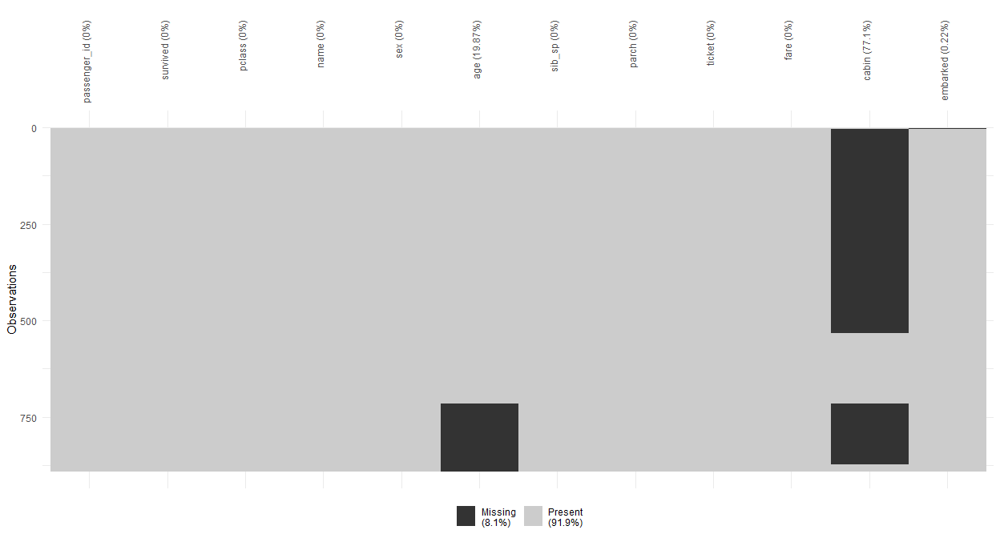
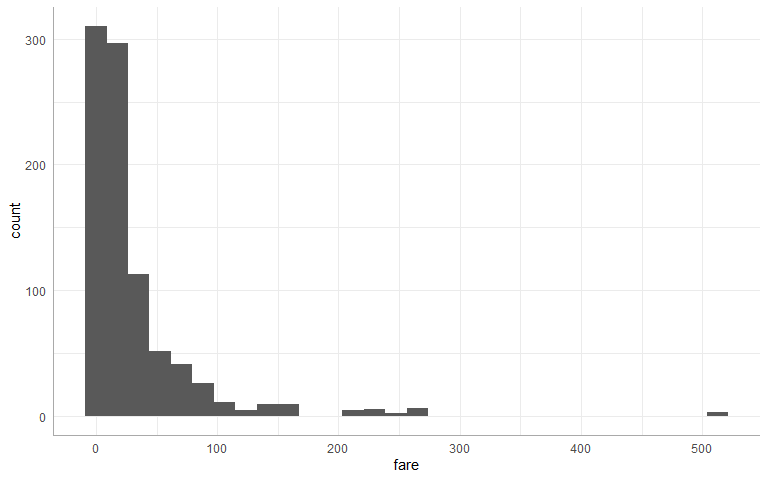
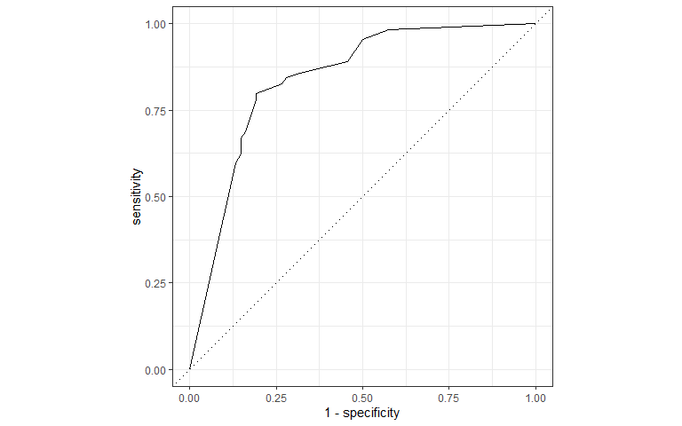
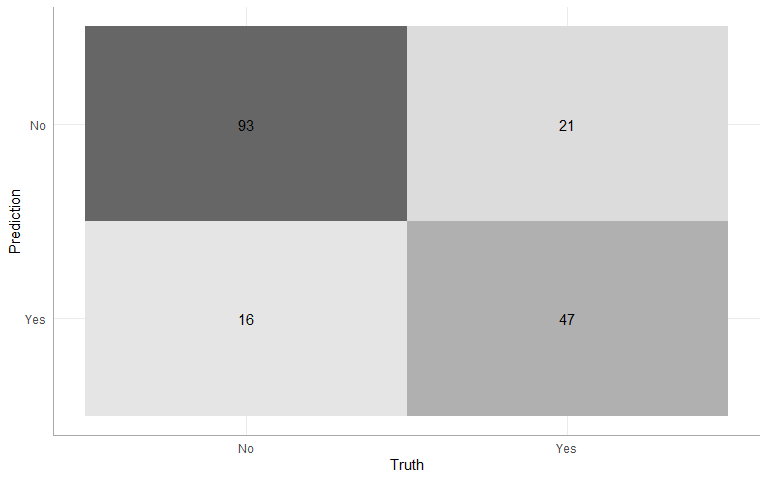
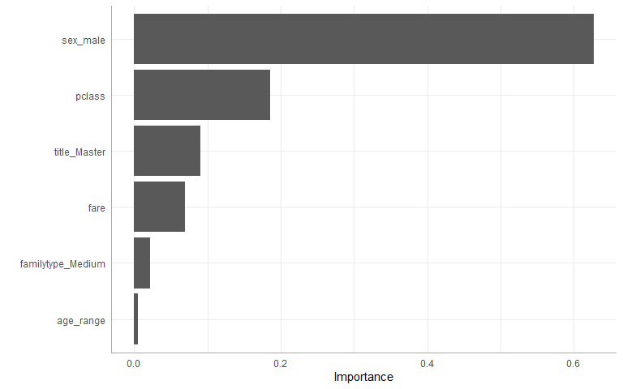
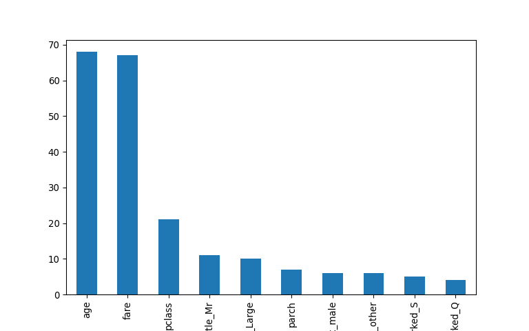
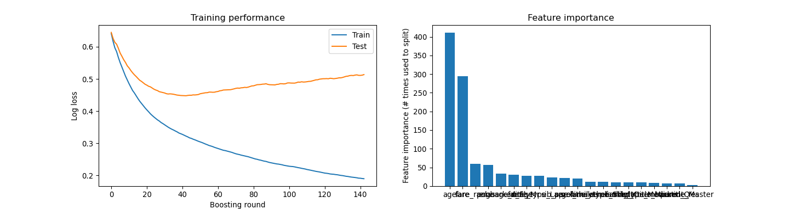

R v2 Titanic
================
Matthew Wilson
15 July, 2020

#### Necessary package and themes

``` r
library(tidyverse)
library(tidymodels)
library(skimr)
library(janitor)
library(corrr)
library(vip)
library(visdat)

pal <- c("#0073C2FF","#EFC000FF","#868686FF","#CD534CFF","#7AA6DCFF",
         "#003C67FF","#8F7700FF","#3B3B3BFF","#A73030FF","#4A6990FF")

theme_set(theme_minimal())
theme_update(axis.line.x = element_line(color="dark grey"),
             axis.line.y = element_line(color="dark grey"))

library(reticulate)
```

### Kaggle Competition for Housing Prices (Regression)

``` r
train <- clean_names(read_csv("../../data/train.csv"))
test <- clean_names(read_csv("../../data/test.csv"))
glimpse(train)
```

    ## Rows: 891
    ## Columns: 12
    ## $ passenger_id <dbl> 1, 2, 3, 4, 5, 6, 7, 8, 9, 10, 11, 12, 13, 14, 15, 16,...
    ## $ survived     <dbl> 0, 1, 1, 1, 0, 0, 0, 0, 1, 1, 1, 1, 0, 0, 0, 1, 0, 1, ...
    ## $ pclass       <dbl> 3, 1, 3, 1, 3, 3, 1, 3, 3, 2, 3, 1, 3, 3, 3, 2, 3, 2, ...
    ## $ name         <chr> "Braund, Mr. Owen Harris", "Cumings, Mrs. John Bradley...
    ## $ sex          <chr> "male", "female", "female", "female", "male", "male", ...
    ## $ age          <dbl> 22, 38, 26, 35, 35, NA, 54, 2, 27, 14, 4, 58, 20, 39, ...
    ## $ sib_sp       <dbl> 1, 1, 0, 1, 0, 0, 0, 3, 0, 1, 1, 0, 0, 1, 0, 0, 4, 0, ...
    ## $ parch        <dbl> 0, 0, 0, 0, 0, 0, 0, 1, 2, 0, 1, 0, 0, 5, 0, 0, 1, 0, ...
    ## $ ticket       <chr> "A/5 21171", "PC 17599", "STON/O2. 3101282", "113803",...
    ## $ fare         <dbl> 7.2500, 71.2833, 7.9250, 53.1000, 8.0500, 8.4583, 51.8...
    ## $ cabin        <chr> NA, "C85", NA, "C123", NA, NA, "E46", NA, NA, NA, "G6"...
    ## $ embarked     <chr> "S", "C", "S", "S", "S", "Q", "S", "S", "S", "C", "S",...

#### Check for missing values for impute steps

``` r
vis_miss(train, cluster = TRUE)+
  theme(axis.text.x = element_text(angle = 90, vjust = 0.5, hjust=1))
```



#### Check any confounding imputation on fare basd on pclass or embarked

``` python

#check if any hierarch with pclass and embarked
r.train.pivot_table(index=['embarked','pclass'], columns='survived', values='fare', aggfunc='median', margins = True)
```

    ## survived             0.0      1.0      All
    ## embarked pclass                           
    ## C        1.0     55.4417  79.2000  78.2667
    ##          2.0     25.8604  24.0000  24.0000
    ##          3.0      7.2292  14.4542   7.8958
    ## NA       1.0         NaN  80.0000  80.0000
    ## Q        1.0     90.0000  90.0000  90.0000
    ##          2.0     12.3500  12.3500  12.3500
    ##          3.0      7.7500   7.7500   7.7500
    ## S        1.0     38.5000  56.4500  52.0000
    ##          2.0     13.0000  22.0000  13.5000
    ##          3.0      8.0500   9.5000   8.0500
    ## All              10.5000  26.0000  14.4542

``` python

#check if any hierarch with pclass and embarked
r.train.groupby('embarked').fare.median().sort_values()
```

    ## embarked
    ## Q      7.75
    ## S     13.00
    ## C     29.70
    ## NA    80.00
    ## Name: fare, dtype: float64

``` r
train %>% group_by(embarked,survived) %>% tally() %>% mutate(pct = n / sum(n))
```

    ## # A tibble: 7 x 4
    ## # Groups:   embarked [4]
    ##   embarked survived     n   pct
    ##   <chr>       <dbl> <int> <dbl>
    ## 1 C               0    75 0.446
    ## 2 C               1    93 0.554
    ## 3 Q               0    47 0.610
    ## 4 Q               1    30 0.390
    ## 5 S               0   427 0.663
    ## 6 S               1   217 0.337
    ## 7 <NA>            1     2 1

#### Fare is really skewed right

``` r
#print(train %>% select(survived, fare) %>% group_by(survived) %>% skim())
ggplot(train, aes(x=fare))+
  geom_histogram()
```



### initial data split

``` r
#resample
train$survived <- factor(train$survived, labels = c("No", "Yes"))

set.seed(19)
data_split <- initial_split(train, 
                            prop = .80,
                            strata = survived)

X_train <- training(data_split)
X_test <- testing(data_split)
```

#### preprocessing

``` r
xgb_recipe <- 
  recipe(survived ~ ., data = X_train) %>%
  update_role(passenger_id, new_role = "id") %>%
  step_nzv(all_nominal()) %>%
  step_mutate(title = str_sub(name, str_locate(name, ",")[,1] + 2, str_locate(name, "\\.")[,1]-1)) %>% 
  step_other(title, threshold = .03) %>% 
  step_mutate(
    alone = as_factor(ifelse(sib_sp + parch < 1, "Yes", "No")),
    parent = as_factor(ifelse(parch > 0, "Yes", "No")),
    familytype = as_factor(ifelse(parch + sib_sp + 1 > 4, "Large", 
                       ifelse(parch + sib_sp + 1 == 1, "Single", "Medium"))),
    fare_range = ntile(fare,5),
    age_range =  ntile(age,4)) %>% 
  step_rm(name, cabin, ticket) %>% 
  step_mutate(fare = ifelse(fare > 100, 100, fare)) %>% 
  step_string2factor(all_nominal(), -all_outcomes()) %>%
  step_bagimpute(all_predictors(), -all_outcomes()) %>% 
  step_normalize(all_numeric(), -all_outcomes(), -has_role("id")) %>% 
  step_dummy(all_nominal(), -all_outcomes(), one_hot = TRUE) %>% 
  step_corr(all_numeric(), -all_outcomes(),threshold = .80)
```

#### Cross check basic xgb model

``` r
xgb_init <- boost_tree(
      trees = 1000,
      min_n = 25,
      tree_depth = 10,
      learn_rate = 0.007,
      loss_reduction = 3.06673510485747e-08
      ) %>% 
  set_engine("xgboost") %>% 
  set_mode('classification')

xgb_wf <- 
  workflow() %>%
  add_model(xgb_init) %>% 
  add_recipe(xgb_recipe)

set.seed(19)
folds <- vfold_cv(X_train, strata = survived, v = 3)

xgb_results <- fit_resamples(
    xgb_wf,
    folds,
    metrics = metric_set(roc_auc, pr_auc, accuracy, f_meas),
    control = control_resamples(save_pred = TRUE)
    )
  
#baseline model results
xgb_results %>% collect_metrics()
```

    ## # A tibble: 4 x 5
    ##   .metric  .estimator  mean     n  std_err
    ##   <chr>    <chr>      <dbl> <int>    <dbl>
    ## 1 accuracy binary     0.797     3 0.00936 
    ## 2 f_meas   binary     0.840     3 0.00831 
    ## 3 pr_auc   binary     0.863     3 0.0159  
    ## 4 roc_auc  binary     0.847     3 0.000719

``` r
#check it on the test
xgb_trained <- 
  xgb_wf %>% 
  fit(X_train)

xgb_trained %>% 
  predict(X_test) %>% 
  bind_cols(select(X_test,survived)) %>% 
  metrics(survived, .pred_class)
```

    ## # A tibble: 2 x 3
    ##   .metric  .estimator .estimate
    ##   <chr>    <chr>          <dbl>
    ## 1 accuracy binary         0.808
    ## 2 kap      binary         0.580

## model spec for XGBoost tuning

``` r
#parsnip and tune

xgb_model <-
    boost_tree(
      mode = 'classification',
      trees = 1000,
      min_n = tune(),
      tree_depth = tune(),
      learn_rate = tune(),
      loss_reduction = tune()
    ) %>% 
    set_engine('xgboost')
```

### grid spec parameters

``` r
#dials

xgb_params <-
  parameters(
    min_n(),
    tree_depth(),
    learn_rate(),
    loss_reduction())

xgb_grid <- grid_latin_hypercube(
    xgb_params,
    size = 15
)

xgb_grid
```

    ## # A tibble: 15 x 4
    ##    min_n tree_depth learn_rate loss_reduction
    ##    <int>      <int>      <dbl>          <dbl>
    ##  1     9          2   1.97e- 5       1.40e- 7
    ##  2    11          9   4.39e- 7       2.36e- 2
    ##  3    12         15   6.82e-10       1.77e- 9
    ##  4    17         12   2.18e- 6       4.84e- 6
    ##  5     6          4   1.21e- 4       4.74e- 8
    ##  6    25          7   2.73e- 5       1.11e+ 1
    ##  7    24         11   1.99e- 3       6.02e- 5
    ##  8    36         13   2.20e- 7       2.77e- 4
    ##  9    20         10   1.20e- 8       2.24e- 1
    ## 10    30          3   6.17e- 2       1.66e-10
    ## 11    34          8   6.87e- 8       1.46e- 8
    ## 12    29          2   7.70e- 3       2.74e- 3
    ## 13     4          6   1.73e- 9       8.40e- 2
    ## 14    38         12   1.45e-10       2.81e- 6
    ## 15    18          5   1.19e- 3       3.88e+ 0

### hyperparameter tuning

``` r
xgb_wf <- update_model(xgb_wf, xgb_model)

# tune resample set
set.seed(19)
folds <- vfold_cv(X_train, strata = survived, v = 3)

xgb_tuned <- tune_grid(
  xgb_wf,
  resamples = folds,
  grid = xgb_grid,
  metrics = metric_set(roc_auc, pr_auc, accuracy, f_meas),
  control = control_grid(save_pred = TRUE)
)
```

``` r
#top 5 best hyperparamaters
xgb_tuned %>%  show_best(metric = "accuracy")
```

    ## # A tibble: 5 x 9
    ##   min_n tree_depth learn_rate loss_reduction .metric .estimator  mean     n
    ##   <int>      <int>      <dbl>          <dbl> <chr>   <chr>      <dbl> <int>
    ## 1     6          4   1.21e- 4  0.0000000474  accura~ binary     0.797     3
    ## 2     4          6   1.73e- 9  0.0840        accura~ binary     0.794     3
    ## 3    12         15   6.82e-10  0.00000000177 accura~ binary     0.789     3
    ## 4    18          5   1.19e- 3  3.88          accura~ binary     0.789     3
    ## 5    20         10   1.20e- 8  0.224         accura~ binary     0.789     3
    ## # ... with 1 more variable: std_err <dbl>

### Select best hyperparamters

``` r
#create model with best tuning parameters
#best hyperparamaters
xgb_best_params <- xgb_tuned %>% select_best(metric = "accuracy")
xgb_model_final <- xgb_model %>% finalize_model(xgb_best_params)

#update the wofklow
xgb_wf <- update_model(xgb_wf, xgb_model_final)
```

#### Evaluate performance

``` r
set.seed(19)
folds <- vfold_cv(X_train, strata = survived, v = 5)

xgb_results <- fit_resamples(
    xgb_wf,
    folds,
    metrics = metric_set(roc_auc, pr_auc, accuracy, f_meas),
    control = control_resamples(save_pred = TRUE)
    )
  
#baseline model results
xgb_results %>% collect_metrics()
```

    ## # A tibble: 4 x 5
    ##   .metric  .estimator  mean     n std_err
    ##   <chr>    <chr>      <dbl> <int>   <dbl>
    ## 1 accuracy binary     0.795     5  0.0160
    ## 2 f_meas   binary     0.841     5  0.0106
    ## 3 pr_auc   binary     0.898     5  0.0124
    ## 4 roc_auc  binary     0.849     5  0.0178

#### Final validation on holdout test

``` r
xgb_wf <- update_recipe(xgb_wf, xgb_recipe)

#check it on the test
xgb_trained <- 
  xgb_wf %>% 
  fit(X_train)


xgb_trained %>% 
    predict(X_test) %>% 
    bind_cols(select(X_test, survived)) %>% 
    metrics(survived, .pred_class)
```

    ## # A tibble: 2 x 3
    ##   .metric  .estimator .estimate
    ##   <chr>    <chr>          <dbl>
    ## 1 accuracy binary         0.791
    ## 2 kap      binary         0.552

### ROC Curve

``` r
xgb_trained %>% 
    predict(X_test, type = "prob") %>% 
    bind_cols(select(X_test, survived)) %>% 
    roc_curve(survived, .pred_Yes) %>%
    autoplot()
```



``` r
xgb_trained %>% 
    predict(X_test) %>% 
    bind_cols(select(X_test, survived)) %>% 
    conf_mat(truth = survived, .pred_class) %>% 
    autoplot(type = "heatmap")
```


\#\#\#\# Feature importance

``` r
xgb_trained %>%  
  pull_workflow_fit() %>% 
  vip(num_features = 20)
```

    ## Warning: `as.tibble()` is deprecated as of tibble 2.0.0.
    ## Please use `as_tibble()` instead.
    ## The signature and semantics have changed, see `?as_tibble`.
    ## This warning is displayed once every 8 hours.
    ## Call `lifecycle::last_warnings()` to see where this warning was generated.



## Other model considerations

#### logistic regression

``` r
lg_model <-
logistic_reg() %>% 
  set_engine("glm") %>% 
  set_mode("classification")

lg_wf <- update_model(xgb_wf, lg_model)


#check it on the test
lg_trained <- 
  lg_wf %>% 
  fit(X_train)

lg_trained %>% 
  predict(X_test) %>% 
  bind_cols(select(X_test,survived)) %>% 
  metrics(survived, .pred_class)
```

    ## Warning in predict.lm(object, newdata, se.fit, scale = 1, type = if (type == :
    ## prediction from a rank-deficient fit may be misleading

    ## # A tibble: 2 x 3
    ##   .metric  .estimator .estimate
    ##   <chr>    <chr>          <dbl>
    ## 1 accuracy binary         0.802
    ## 2 kap      binary         0.574

#### random forest

``` r
rf_model <-
rand_forest(mtry = 8,
            min_n = 30,
            trees = 1500) %>% 
  set_engine("ranger") %>% 
  set_mode("classification")

rf_wf <- update_model(xgb_wf, rf_model)


#check it on the test
rf_trained <- 
  rf_wf %>% 
  fit(X_train)

rf_trained %>% 
  predict(X_test) %>% 
  bind_cols(select(X_test,survived)) %>% 
  metrics(survived, .pred_class)
```

    ## # A tibble: 2 x 3
    ##   .metric  .estimator .estimate
    ##   <chr>    <chr>          <dbl>
    ## 1 accuracy binary         0.814
    ## 2 kap      binary         0.584

#### support vector machine

``` r
sv_model <-
svm_rbf() %>% 
  set_engine("kernlab") %>% 
  set_mode("classification")
  
sv_wf <- update_model(xgb_wf, sv_model)


#check it on the test
sv_trained <- 
  sv_wf %>% 
  fit(X_train)

sv_trained %>% 
  predict(X_test) %>% 
  bind_cols(select(X_test,survived)) %>% 
  metrics(survived, .pred_class)
```

    ## # A tibble: 2 x 3
    ##   .metric  .estimator .estimate
    ##   <chr>    <chr>          <dbl>
    ## 1 accuracy binary         0.774
    ## 2 kap      binary         0.497

#### K-nearest neighbor

``` r
knn_model <-
nearest_neighbor() %>% 
  set_engine("kknn") %>% 
  set_mode("classification")

knn_wf <- update_model(xgb_wf, knn_model)


#check it on the test
knn_trained <- 
  knn_wf %>% 
  fit(X_train)

knn_trained %>% 
  predict(X_test) %>% 
  bind_cols(select(X_test,survived)) %>% 
  metrics(survived, .pred_class)
```

    ## # A tibble: 2 x 3
    ##   .metric  .estimator .estimate
    ##   <chr>    <chr>          <dbl>
    ## 1 accuracy binary         0.780
    ## 2 kap      binary         0.520

#### Neural net with multi layer perceptron

``` r
mlp_model <-
  mlp(penalty = 0.01,
      hidden_units = 1,
      epochs = 100) %>% 
  set_engine("nnet") %>% 
  set_mode("classification")

mlp_wf <- update_model(xgb_wf, mlp_model)


#check it on the test
mlp_trained <- 
  mlp_wf %>% 
  fit(X_train)

mlp_trained %>% 
  predict(X_test) %>% 
  bind_cols(select(X_test,survived)) %>% 
  metrics(survived, .pred_class)
```

    ## # A tibble: 2 x 3
    ##   .metric  .estimator .estimate
    ##   <chr>    <chr>          <dbl>
    ## 1 accuracy binary         0.842
    ## 2 kap      binary         0.650

#### Use the best parameters to fit the data and make predictions

``` r
y_pred <- predict(xgb_trained, test)
y_pred$.pred_class <- as.numeric(y_pred$.pred_class) - 1

output <- bind_cols(test$passenger_id, y_pred) %>% rename("PassengerID" = "...1","survived" = ".pred_class")
write.csv(output,file = "output7_16.csv", row.names=FALSE)
```

## lightGBM example mix/match between R and Python

#### r preprocessing

``` r
train <- clean_names(read_csv("../../data/train.csv"))

lightGBM_recipe <- 
  recipe(survived ~ ., data = train) %>%
  step_rm(passenger_id) %>% 
  step_nzv(all_nominal()) %>%
  step_mutate(title = str_sub(name, str_locate(name, ",")[,1] + 2, str_locate(name, "\\.")[,1]-1)) %>% 
  step_other(title, threshold = .03) %>% 
  step_mutate(
    alone = as_factor(ifelse(sib_sp + parch < 1, "Yes", "No")),
    parent = as_factor(ifelse(parch > 0, "Yes", "No")),
    familytype = as_factor(ifelse(parch + sib_sp + 1 > 4, "Large", 
                       ifelse(parch + sib_sp + 1 == 1, "Single", "Medium"))),
    fare_range = ntile(fare,5),
    age_range =  ntile(age,4)) %>% 
  step_rm(name, cabin, ticket) %>% 
  step_mutate(fare = ifelse(fare > 100, NA, fare)) %>% 
  step_string2factor(all_nominal(), -all_outcomes()) %>%
  step_bagimpute(all_predictors(),-all_outcomes()) %>% 
  step_dummy(all_nominal(), -all_outcomes(), one_hot = TRUE) %>% 
  step_corr(all_numeric(), -all_outcomes(),threshold = .95) %>% 
  prep()

baked_gbm <- bake(lightGBM_recipe, train)
test_baked_gbm <- bake(lightGBM_recipe, test)
```

#### import python modules

``` python

import pandas as pd
import numpy as np
import matplotlib.pyplot as plt
import lightgbm as lgbm
from sklearn.model_selection import train_test_split
from sklearn.preprocessing import LabelEncoder
from sklearn.metrics import accuracy_score, recall_score, precision_score, f1_score

r.baked_gbm.info()
```

    ## <class 'pandas.core.frame.DataFrame'>
    ## RangeIndex: 891 entries, 0 to 890
    ## Data columns (total 21 columns):
    ##  #   Column             Non-Null Count  Dtype  
    ## ---  ------             --------------  -----  
    ##  0   pclass             891 non-null    float64
    ##  1   age                891 non-null    float64
    ##  2   sib_sp             891 non-null    float64
    ##  3   parch              891 non-null    float64
    ##  4   fare               891 non-null    float64
    ##  5   survived           891 non-null    float64
    ##  6   fare_range         891 non-null    int32  
    ##  7   age_range          891 non-null    int32  
    ##  8   sex_male           891 non-null    float64
    ##  9   embarked_C         891 non-null    float64
    ##  10  embarked_Q         891 non-null    float64
    ##  11  embarked_S         891 non-null    float64
    ##  12  title_Master       891 non-null    float64
    ##  13  title_Miss         891 non-null    float64
    ##  14  title_Mr           891 non-null    float64
    ##  15  title_Mrs          891 non-null    float64
    ##  16  title_other        891 non-null    float64
    ##  17  parent_Yes         891 non-null    float64
    ##  18  familytype_Medium  891 non-null    float64
    ##  19  familytype_Single  891 non-null    float64
    ##  20  familytype_Large   891 non-null    float64
    ## dtypes: float64(19), int32(2)
    ## memory usage: 139.3 KB

#### Create splits

``` python
X = r.baked_gbm
y = X.pop('survived')

# Take a hold out set randomly
X_train, X_test, y_train, y_test = train_test_split(X, y, test_size=0.2, random_state=42, stratify=y)

# training
train_data = lgbm.Dataset(data=X_train, label=y_train, free_raw_data=False)

# test
test_data = lgbm.Dataset(data=X_test, label=y_test, free_raw_data=False)

# FULL training
final_train_set = lgbm.Dataset(data=X, label=y, free_raw_data=False)
```

``` python

fit_params={"early_stopping_rounds":10, 
            "eval_metric" : 'auc', 
            "eval_set" : [(X_test,y_test)],
            'eval_names': ['valid'],
            'verbose': 100,
            'feature_name': 'auto', # that's actually the default
            'categorical_feature': 'auto' # that's actually the default
           }


clf = lgbm.LGBMClassifier(num_leaves= 15, max_depth=-1, 
                         random_state=314, 
                         silent=True, 
                         metric='None', 
                         n_jobs=4, 
                         n_estimators=1000,
                         colsample_bytree=0.9,
                         subsample=0.9,
                         learning_rate=0.1)
                         
clf.fit(X_train, y_train, **fit_params)
```

    ## Training until validation scores don't improve for 10 rounds
    ## Early stopping, best iteration is:
    ## [16] valid's auc: 0.859618
    ## LGBMClassifier(colsample_bytree=0.9, metric='None', n_estimators=1000, n_jobs=4,
    ##                num_leaves=15, random_state=314, subsample=0.9)

``` python
feat_imp = pd.Series(clf.feature_importances_, index=X.columns)
feat_imp.nlargest(10).plot(kind='bar', figsize=(8,5))
```

    ## <matplotlib.axes._subplots.AxesSubplot object at 0x0000000094F3DE08>

``` python
plt.show()
```



``` python

preds = clf.predict(X_test)
print('Accuracy score = \t {}'.format(accuracy_score(y_test, preds)))
```

    ## Accuracy score =      0.8324022346368715

``` python
print('Precision score = \t {}'.format(precision_score(y_test, preds)))
```

    ## Precision score =     0.8545454545454545

``` python
print('Recall score =   \t {}'.format(recall_score(y_test, preds)))
```

    ## Recall score =        0.6811594202898551

``` python
print('F1 score =      \t {}'.format(f1_score(y_test, preds)))
```

    ## F1 score =        0.7580645161290324

``` python

lgbm_params = {
    'boosting': 'gbrt',          # dart (drop out trees) often performs better
    'application': 'binary',     # Binary classification
    'learning_rate': 0.05,       # Learning rate, controls size of a gradient descent step
    'min_data_in_leaf': 20,      # Data set is quite small so reduce this a bit
    'feature_fraction': 0.7,     # Proportion of features in each boost, controls overfitting
    'num_leaves': 41,            # Controls size of tree since LGBM uses leaf wise splits
    'metric': 'binary_logloss',  # Area under ROC curve as the evaulation metric
    'drop_rate': 0.15
              }

evaluation_results = {}
clf2 = lgbm.train(train_set=train_data,
                 params=lgbm_params,
                 valid_sets=[train_data, test_data], 
                 valid_names=['Train', 'Test'],
                 evals_result=evaluation_results,
                 num_boost_round=500,
                 early_stopping_rounds=100,
                 verbose_eval=20
                )
```

    ## Training until validation scores don't improve for 100 rounds
    ## [20] Train's binary_logloss: 0.410131    Test's binary_logloss: 0.483538
    ## [40] Train's binary_logloss: 0.329897    Test's binary_logloss: 0.448599
    ## [60] Train's binary_logloss: 0.285725    Test's binary_logloss: 0.460315
    ## [80] Train's binary_logloss: 0.254812    Test's binary_logloss: 0.478334
    ## [100]    Train's binary_logloss: 0.229574    Test's binary_logloss: 0.487511
    ## [120]    Train's binary_logloss: 0.208542    Test's binary_logloss: 0.500699
    ## [140]    Train's binary_logloss: 0.191764    Test's binary_logloss: 0.511245
    ## Early stopping, best iteration is:
    ## [43] Train's binary_logloss: 0.322414    Test's binary_logloss: 0.447835

``` python
optimum_boost_rounds = clf2.best_iteration
```

``` python
fig, axs = plt.subplots(1, 2, figsize=[15, 4])

# Plot the log loss during training
axs[0].plot(evaluation_results['Train']['binary_logloss'], label='Train')
```

    ## [<matplotlib.lines.Line2D object at 0x000000009507A808>]

``` python
axs[0].plot(evaluation_results['Test']['binary_logloss'], label='Test')
```

    ## [<matplotlib.lines.Line2D object at 0x000000009507A6C8>]

``` python
axs[0].set_ylabel('Log loss')
```

    ## Text(0, 0.5, 'Log loss')

``` python
axs[0].set_xlabel('Boosting round')
```

    ## Text(0.5, 0, 'Boosting round')

``` python
axs[0].set_title('Training performance')
```

    ## Text(0.5, 1.0, 'Training performance')

``` python
axs[0].legend()

# Plot feature importance
```

    ## <matplotlib.legend.Legend object at 0x0000000095081AC8>

``` python
importances = pd.DataFrame({'features': clf2.feature_name(), 
                            'importance': clf2.feature_importance()}).sort_values('importance', ascending=False)
axs[1].bar(x=np.arange(len(importances)), height=importances['importance'])
```

    ## <BarContainer object of 20 artists>

``` python
axs[1].set_xticks(np.arange(len(importances)))
```

    ## [<matplotlib.axis.XTick object at 0x0000000084C2E2C8>, <matplotlib.axis.XTick object at 0x0000000084C2E288>, <matplotlib.axis.XTick object at 0x000000009505C748>, <matplotlib.axis.XTick object at 0x00000000950CE5C8>, <matplotlib.axis.XTick object at 0x00000000950CEC88>, <matplotlib.axis.XTick object at 0x00000000950D3388>, <matplotlib.axis.XTick object at 0x00000000950D3A88>, <matplotlib.axis.XTick object at 0x00000000950D9188>, <matplotlib.axis.XTick object at 0x00000000950D9848>, <matplotlib.axis.XTick object at 0x00000000950DD1C8>, <matplotlib.axis.XTick object at 0x00000000950DD988>, <matplotlib.axis.XTick object at 0x00000000950D9588>, <matplotlib.axis.XTick object at 0x00000000950CE808>, <matplotlib.axis.XTick object at 0x00000000950E16C8>, <matplotlib.axis.XTick object at 0x00000000950E52C8>, <matplotlib.axis.XTick object at 0x00000000950E5B48>, <matplotlib.axis.XTick object at 0x00000000950EB5C8>, <matplotlib.axis.XTick object at 0x00000000950F0108>, <matplotlib.axis.XTick object at 0x00000000950F0A88>, <matplotlib.axis.XTick object at 0x00000000950F4508>]

``` python
axs[1].set_xticklabels(importances['features'])
```

    ## [Text(0, 0, 'age'), Text(0, 0, 'fare'), Text(0, 0, 'fare_range'), Text(0, 0, 'pclass'), Text(0, 0, 'embarked_S'), Text(0, 0, 'age_range'), Text(0, 0, 'title_Mr'), Text(0, 0, 'familytype_Large'), Text(0, 0, 'sib_sp'), Text(0, 0, 'parch'), Text(0, 0, 'sex_male'), Text(0, 0, 'title_other'), Text(0, 0, 'familytype_Single'), Text(0, 0, 'embarked_C'), Text(0, 0, 'title_Mrs'), Text(0, 0, 'familytype_Medium'), Text(0, 0, 'title_Miss'), Text(0, 0, 'embarked_Q'), Text(0, 0, 'parent_Yes'), Text(0, 0, 'title_Master')]

``` python
axs[1].set_ylabel('Feature importance (# times used to split)')
```

    ## Text(0, 0.5, 'Feature importance (# times used to split)')

``` python
axs[1].set_title('Feature importance')
```

    ## Text(0.5, 1.0, 'Feature importance')

``` python
plt.show()
```



``` python

preds = np.round(clf2.predict(X_test))
print('Accuracy score = \t {}'.format(accuracy_score(y_test, preds)))
```

    ## Accuracy score =      0.8156424581005587

``` python
print('Precision score = \t {}'.format(precision_score(y_test, preds)))
```

    ## Precision score =     0.8103448275862069

``` python
print('Recall score =   \t {}'.format(recall_score(y_test, preds)))
```

    ## Recall score =        0.6811594202898551

``` python
print('F1 score =      \t {}'.format(f1_score(y_test, preds)))
```

    ## F1 score =        0.7401574803149606

``` python

clf_final = lgbm.train(train_set=final_train_set,
                      params=lgbm_params,
                      num_boost_round=optimum_boost_rounds,
                      verbose_eval=0
                      )

y_pred = np.round(clf_final.predict(r.test_baked_gbm)).astype(int)
```

``` python
output = pd.DataFrame({'PassengerId': r.test['passenger_id'], 'Survived': y_pred})
output.head()
```

    ##    PassengerId  Survived
    ## 0        892.0         0
    ## 1        893.0         0
    ## 2        894.0         0
    ## 3        895.0         0
    ## 4        896.0         1

``` r
write.csv(py$output,file = "output_gbm.csv", row.names=FALSE)
```
